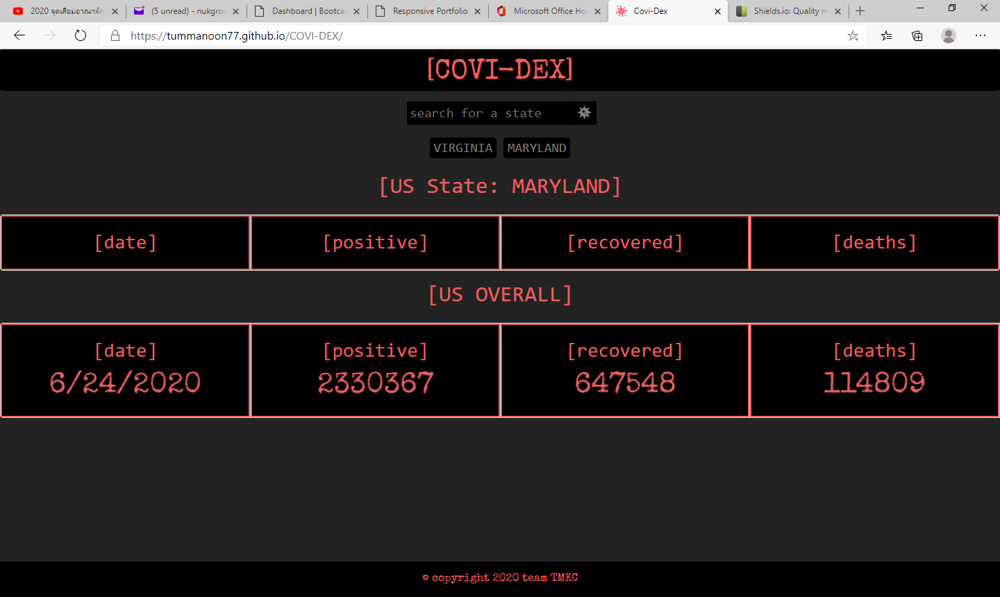

# COVIDEX

# Project Title

Project CoviDex is a simple data display app showing key coronavirus infection data (from local API) by state and for the US overall.

## deployment

https://tummanoon77.github.io/COVI-DEX/

Use the search input to search by US state and see the daily data populate for date | positive | recovered | death

**add note about yesterday vs todays data logic

### Installing

click: https://tummanoon77.github.io/COVI-DEX/

End with an example of getting some data out of the system or using it for a little demo

validate successful navigation to our site:

### Break down into end to end tests
to use our site
1) click into the search input box and type a valid US State (current MVP does not support error handling)
2) click the search button (virus icon)
3) observe data population
4) buttons for previous searches persist at the top, click these to change data view to corresponding state

## Tech list:

HTML/CSS/vanilla JS
jQuery
Bootstrap
API calling technology with AJAX
Introducing *Animate

### Collaborators
* [Kouros](https://github.com/koutron)

* [Tummanoon](https://github.com/tummanoon77) 

* [Mason](https://github.com/sungjinkimm) 

* [Claudia](https://github.com/claudialoves)

## Versioning

Jira backlog for user stories which contributed to the development of this MVP: https://kmtc.atlassian.net/secure/RapidBoard.jspa?rapidView=1&projectKey=CA&view=planning.nodetail&selectedIssue=CA-82&issueLimit=100 For the versions available, see the [tags on this repository](https://github.com/your/project/tags). 

## Acknowledgments

cute things, lovely things, team work (makes the dream work!), and weekend zooming!
shout out to humanity in these pandemic times!!! love to the universe and everyone!!

## License

MIT License

## ScreenShot

